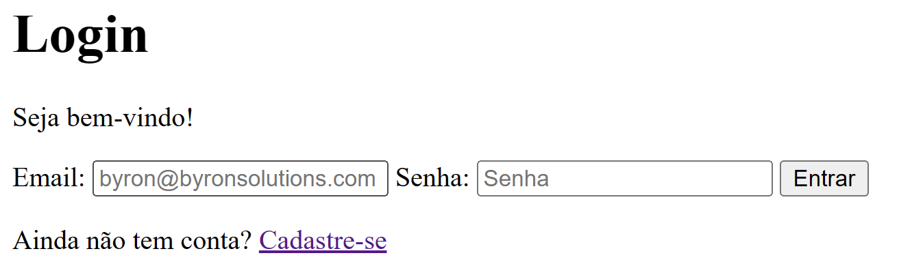

Agora que você já sabe o básico de html, vamos praticar com um exemplo prático.

## Formulário de login

Vamos supor que vamos criar o esqueleto de uma tela de login, apenas usando o HTML. Pensando nisso, poderiamos organizar nossa tela com os seguintes elementos:

- ### **Título:**

  Como aprendemos anterioremente os títulos são representados pelas tags "h". Para fazer o título principal usaremos a tag `<h1>`:

  ```html
  <h1>Login</h1>
  ```

- ### **Texto genérico de seja bem-vindo:**

  Para o nosso texto genérico, podemos utilizar a tag `<p>` da seguinte forma:

  ```html
  <p>Seja bem-vindo!</p>
  ```

- ### **Formulários de e-mail e senha:**

  Para o nosso formulário de email, vamos criar uma caixa de texto usando a tag `<input>` com os atributos "type" (indica o tipo de conteúdo que vai receber) e "placeholder" (texto base do input) precedido de um indicativo da função do input, onde usaremos a tag `<label>`:

  ```html
  <label>Email:</label>
  <input type="email" placeholder="byron@byronsolutions.com" />
  ```

  Para o formulário de senhha usaremos e mesma sintaxe, apenas mudando o conteúdo de dentro de cada tag:

  ```html
  <label>Senha:</label> <input type="password" placeholder="Senha" />
  ```

- ### **Botão de login:**

  Para o nosso botão de login, usaremos novamente a tag `<input>` mas dessa vez sem o atributo "placeholder" e com o atributo "value" (Texto que vai aparecer no input):

  ```html
  <input type="submit" value="Entrar" />
  ```

:::note
Os Formulários de e-mail e senha e o botão de login fazem parte de um formulário de login, portanto todos estarão entre uma tag `<form>`, da seguinte forma:

```html
<form>
  <!--FORMULÁRIO EMAIL-->
  <label>Email:</label>
  <input type="email" placeholder="byron@byronsolutions.com" />

  <!--FORMULÁRIO SENHA-->
  <label>Senha:</label>
  <input type="password" placeholder="Senha" />

  <!--BOTÃO LOGAR-->
  <input type="submit" value="Entrar" />
</form>
```

:::

- ### **Redirecionamento para tela de cadastro:**

  Caso o usuário ainda não tenha uma conta, criaremos um link para redirecionar-lo para uma possível página de cadastro. Para isso utilizaremos a tag `<p>` e dentro dela colocaremos o link com a tag `<a>`:

  ```html
  <p>Ainda não tem conta? <a href="">Cadastre-se</a></p>
  ```

Juntando tudo isso com a estrutura básica já vista, obtemos:

```html
<!DOCTYPE html>
<html lang="en">
  <head>
    <meta charset="UTF-8" />
    <meta name="viewport" content="width=device-width, initial-scale=1.0" />
    <title>Página de login</title>
  </head>
  <body>
    <!--TÍTULO-->
    <h1>Login</h1>
    <p>Seja bem-vindo!</p>

    <form>
      <!--FORMULÁRIO EMAIL-->
      <label>Email:</label>
      <input type="email" placeholder="byron@byronsolutions.com" />

      <!--FORMULÁRIO SENHA-->
      <label>Senha:</label>
      <input type="password" placeholder="Senha" />

      <!--BOTÃO LOGAR-->
      <input type="submit" value="Entrar" />
    </form>

    <!--LINK PARA TELLA DE CADASTRO-->
    <p>Ainda não tem conta? <a href="">Cadastre-se</a></p>
  </body>
</html>
```

Com isso obtemos o seguinte resultado:


