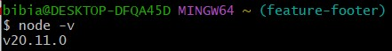
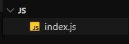
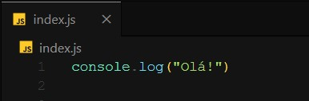
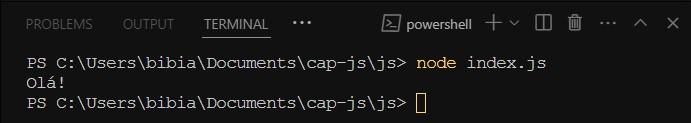

JavaScript é uma linguagem de script orientada a objetos e plataforma cruzada usada para tornar as páginas da Web interativas (por exemplo, com animações complexas, botões clicáveis, menus pop-up etc.). Há também versões mais avançadas do lado do servidor do JavaScript, como Node.js, que permitem adicionar mais funcionalidades a um site do que baixar arquivos, como colaboração em tempo real entre vários computadores. Dentro de um ambiente de host (por exemplo, um navegador da Web), o JavaScript pode ser conectado aos objetos de seu ambiente para fornecer controle programático sobre eles.

É uma linguagem versátil e amigável para iniciantes na programação. Com mais experiência, será possível criar jogos, gráficos 2D e 3D animados e muito mais.

## Iniciando

1. Instale o node.js no seu computador  
   &nbsp;
   Vá até Guia de capacitações -> Ferramentas básicas
   &nbsp;

2. Abra um terminal e teste se está funcionando por meio do comando node -v
     
   &nbsp;
   Se retornar algo similar, está funcionando
   &nbsp;

3. Crie uma pasta para o curso e abra-a no Visual Studio Code

4. Crie um arquivo com terminação js, por exemplo:  
   &nbsp;

   &nbsp;
   

5. Para testar, escreva isso dentro do seu arquivo js
   &nbsp;

   &nbsp;
   

6. Abra seu terminal e execute o arquivo. Dessa forma:

   
   A estrutura para executar é node index.js  
   &nbsp;

   &nbsp;

---

## Videoaula

<video src="https://www.youtube.com/embed/0njhVlYOKyw?list=PLc77ERAwzB_0-C3oGJm0y-HPBf2dWS7UL" />
