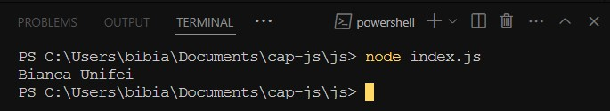
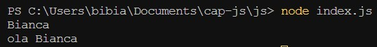

Uma variável é um container para um valor, como um número que podemos usar em uma operação de adição, ou uma sequência de texto que possamos usar como parte de uma oração.
Uma coisa especial sobre as variáveis é que elas podem conter praticamente qualquer coisa — não apenas cadeias de texto e números. Variáveis também podem conter dados complexos e até mesmo funções completas para fazer coisas incríveis.

#### Observe a sintaxe da declaração de uma variável

```javascript
let | var [ identificador ] [ = valor | expressão ]
```

**identificador:** nome da variável  
&nbsp;
**valor:** valor inicial da variável, que pode ser uma string, um número, um boolean ou uma expressão.
&nbsp;

---

## Formas de declarar

### var

Digita-se a palavra chave var seguido pelo nome desejado para a variável, por exemplo:

```javascript
var nome;
var faculdade;
```

**Importante:** No JavaScript, todas as instruções em código deve terminar com um ponto e vírgula (;)

Quando não possuem valor, são containers vazios, como o que foi feito acima. Se você insere o nome de uma variável, deve obter como retorno o valor dela, um valor undefined ou uma mensagem de erro (caso a variável não exista).

#### Declarando uma variável e adicionando valor

```javascript
var nome = "Bianca";
var faculdade = "Unifei";

console.log(nome,faculdade)
```

&nbsp;
O console.log serve para mostrar o valor das variáveis no terminal e o valor da variável deve ser entre aspas quando for uma string
&nbsp;

  
&nbsp;
O que deverá aparecer no terminal
&nbsp;

Retire os valores das variáveis e execute, dessa forma:

```javascript
var nome;
var faculdade;

console.log(nome,faculdade)
```

&nbsp;
Note que a saída do terminal será `undefined`, uma vez que não possuem mais valor
&nbsp;

**Importante:** O nome das variáveis deve ser separado por vírgulas dentro do console.log, como foi feito anteriormente. Além disso, deve ser utilizado o camelcase para nomes com mais de uma palavra.

```javascript
var nomeSobrenome = "Bianca Rossi";
```

&nbsp;
Exemplo camelcase
&nbsp;

### let

Para explicar a diferença entre declaração de tipo let e de tipo var, explicarei primeiro quais são os tipos de escopo dentro de um código.

**Escopo global:** é possível chamar a variável fora e dentro de funções, observe:

```javascript
var nome = "Bianca";

function func1(){
    console.log("ola" + " " + nome)
}

console.log(nome)
func1()
```



**Escopo local:** a variável é definida dentro de uma função e só aquela função poderá chamá-la. Se for chamada em outro lugar, dará erro.

```javascript
var nome = "Bianca";

function fun1 (){
    var sobrenome = "Rossi";
    console.log ("ola" + " " + nome + " " + sobrenome)
}

console.log(sobrenome)
func1()
```

**Escopo de bloco:** bloco é definido por abre e fecha chaves ( { } ). A variável é contida dentro do bloco, veja:

```javascript
let a = 10;
let validar = true;

if(validar){
    let b = 15
    console.log(a+b)
}
```

&nbsp;
Nesse caso, a variável a foi chamada dentro do if
&nbsp;

Dito tudo isso, a diferença é:

- `let` funciona em escopo global, local e de bloco
- `var` só funciona em global e local

Ademais, também sabe-se que a declaração do tipo var pode ser atualizada e declarada novamente dentro do escopo global, enquanto a declaração do tipo let podem ser atualizadas, mas não podem ser redeclaradas.

```javascript
let a = 30;
let a = 15;

console.log(a)
```

&nbsp;
Execute e perceba que dará erro, porque foi feita a redeclaração da variável `let`
&nbsp;

```javascript
let a = 30;
a = 15;

console.log(a)
```

&nbsp;
E assim funcionará porque o valor está apenas sendo atualizado
&nbsp;

**Importante:**

```javascript
console.log(a)
let a = 10;
console.log(a)
```

&nbsp;
Com a declaração tipo `let`, o terminal exibe um erro caso tente imprimir a variável antes de declará-la
&nbsp;

### const

É um valor que uma vez declarado não pode ser alterado. Há muitas razões pelas quais você deseja fazer isso, desde segurança até a depuração e a compreensão do código. Funciona da mesma forma que let, porém não é permitido que um novo valor seja atribuído

```javascript
const diasNaSemana = 7;
const horasNoDia = 24;
```

---

## Tipos de variáveis

**Números**  
&nbsp;
Você pode armazenar números em variáveis, tanto números inteiros, quanto decimais
&nbsp;

```javascript
let minhaIdade = 21;
```

**Strings**  
&nbsp;
São sequências de textos. Quando você dá a uma variável um valor em texto, você precisa envolver o texto em aspas simples ou duplas, senão será interpretado como sendo outro nome de variável
&nbsp;

```javascript
let linguagem = "Estamos aprendendo JavaScript!";
```

**Booleans**  
&nbsp;
São valores verdadeiro/falso (true/false). São geralmente usados para verificar uma condição, que em seguida o código é executado apropriadamente. Exemplo:
&nbsp;

```javascript
let a = true;
let b = 10;

if(a){
let c = 12;
console.log(b + c);
}
```

**Arrays**  
&nbsp;
Um array é um único objeto que contém valores múltiplos inseridos entre colchetes e separados por vírgulas
&nbsp;

```javascript
let numeros = [15, 30, 45];
```

Caso queira exibir apenas um número no terminal, dê o console.log dessa forma:

```javascript
let numeros = [15, 30, 45];

console.log(numeros[0])
```

&nbsp;
Lembre-se que a contagem do array começa em 0, portanto exibirá o número 15 no terminal
&nbsp;

**Objetos**  
&nbsp;
Em programação, um objeto é uma estrutura de código que representa um objeto da vida real. você poderia ter um objeto que representa uma pessoa, e contém dados sobre seu nome, altura, peso, que idioma ela fala, etc
&nbsp;

```javascript
let aluno = {
    nome: "Bianca",
    idade: 21,
    seFormou: false,
}

console.log(aluno)
```

&nbsp;
Teste com as suas informações
&nbsp;

```javascript
let aluno = {
    nome: "Bianca",
    idade: 21,
    seFormou: false,
}

console.log(aluno.idade)
```

&nbsp;
Para extrair algo específico do objeto utilize essa estrutura
&nbsp;

**Importante:** JavaScript é uma "dynamically typed language", o que significa que você não precisa especificar que tipo de dados uma variável irá conter (números, strings, arrays, etc)

---

## Videoaula

<video src="https://www.youtube.com/embed/gchp4ctpL7k?list=PLc77ERAwzB_0-C3oGJm0y-HPBf2dWS7UL" />

---

import Quiz from "@site/src/components/Quiz";

## Quizz

```javascript
console.log(a);
var a = 10;
console.log(a);

console.log(b);
let b = 20;
console.log(b);
```

<Quiz
  question="1. Qual será o resultado da execução do código acima?"
  answers={[
    " undefined, 10, undefined, 20",
    "undefined, 10, ReferenceError, 20",
    "undefined, 10, ReferenceError",
    "10, 10, 20, 20",
  ]}
  correctIndex={2}
/>

<Quiz
  question="2. Assinale a alternativa verdadeira"
  answers={[
    "Ambas as palavras-chave `var` e `let` têm escopo de bloco, mas var permite redeclarar variáveis no mesmo escopo, enquanto `let` não permite",
    "`var` tem escopo de bloco, enquanto let tem escopo de função",
    "Variáveis declaradas com `var` podem ser redeclaradas dentro do mesmo escopo, enquanto variáveis declaradas com `let` não podem ser redeclaradas no mesmo escopo",
    "A palavra-chave `var` é usada para declarar variáveis de valor constante, enquanto `let` é usada para variáveis cujo valor pode ser alterado durante a execução do programa",
  ]}
  correctIndex={2}
/>

<Quiz
  question="3. Assinale a alternativa verdadeira"
  answers={[
    "`const` é usada para declarar uma variável cujo valor pode ser alterado durante a execução do programa",
    "Uma vez que uma variável é declarada com `const`, seu valor não pode ser alterado",
    "`const` só pode ser usada para declarar variáveis numéricas",
    "`const` é uma forma abreviada de `constant`, mas não é uma palavra-chave reservada em JavaScript",
  ]}
  correctIndex={1}
/>
