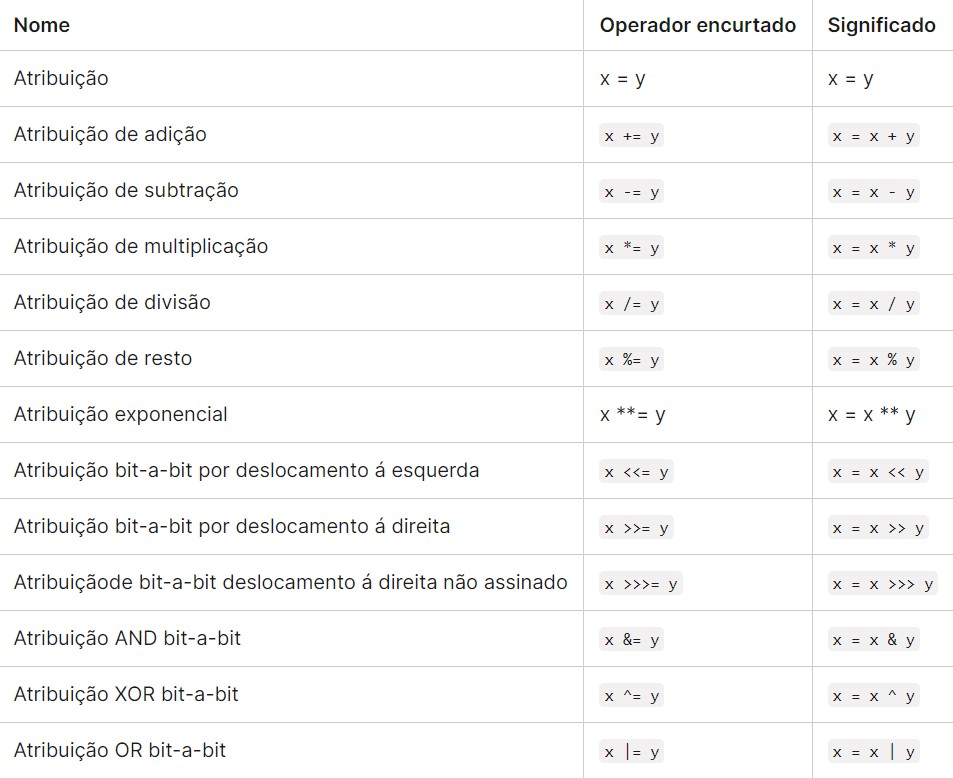

### Aritméticos

São os operadores que utilizamos para fazer as operações aritiméticas básicas

**Soma:** adiciona um número a outro

```javascript
let a = 10;
let b = 5;

console.log(a + b)
```

**Subtraçao:** subtrai um número do outro

```javascript
let a = 10;
let b = 5;

console.log(a - b)
```

**Multiplicação:** multiplica um número pelo outro

```javascript
let a = 10;
let b = 5;

console.log(a * b)
```

**Divisão:** divide o número da esquerda pelo número da direita

```javascript
let a = 10;
let b = 5;

console.log(a / b)
```

**Resto:** retorna o resto da divisão em números inteiros do número da esquerda pelo número da direita

```javascript
let a = 10;
let b = 5;

console.log(a & b)
```

---

### Comparação

Às vezes é necessário fazer uma comparação entre duas variáveis, para isso são utilizados os operadores de comparação

**Igualdade estrita:** verifica se os valores são idênticos entre si

```javascript
let a = 10;
let b = 5;

console.log(a === b)
```

**Não igualdade estrita:** verifica se os valores não são idênticos entre si

```javascript
let a = 10;
let b = 5;

console.log(a !== b)
```

**Menor que:** verifica se os valores não são idênticos entre si

```javascript
let a = 10;
let b = 5;

console.log(a < b)
```

**Maior que:** verifica se o valor da esquerda é maior que o valor da direita

```javascript
let a = 10;
let b = 5;

console.log(a > b)
```

**Menor ou igual:** verifica se o valor da esquerda é menor que ou igual ao valor da direita

```javascript
let a = 10;
let b = 5;

console.log(a <= b)
```

**Maior ou igual:** verifica se o valor da esquerda é maior que ou igual ao valor da direita

```javascript
let a = 10;
let b = 5;

console.log(a >= b)
```

**Importante:** a diferença entre `==` e `===` é que a primeira não compara o tipo de dado

```javascript
let a = 5;
let b = "5";

console.log(a == b)
```

&nbsp;
No caso apresentado acima, o terminal retornaria true, porque não compararia o tipo de dado da variável
&nbsp;

---

### Lógicos

**And:** exige que todas as condições estejam corretas para que possa retornar true

```javascript
let a = 5;
let b = 5;
let c = 5;

console.log(a == b && b == c)
```

**Or:** exige que apenas uma das condições estejam corretas para que possa retornar true

```javascript
let a = 5;
let b = 5;
let c = 2;

console.log(a == b || b == c)
```

**Not:** é usado para inverter o valor booleano de uma expressão. Se a expressão for verdadeira, o resultado será falso e vice versa

```javascript
let fizCompras = false;

if(!fizCompras){
	console.log("vá ao shopping!");
} else {
	console.log("vamos economizar?");
}
```

&nbsp;
Note que ao inverter a expressão dentro do parenteses ela se tornará verdadeira, portanto entrará no bloco do if. Caso fosse true na primeira linha, se tornaria false devido à inversão e entraria no bloco do else
&nbsp;

---

### Operadores encurtados



---

## Videoaula

<video src="https://www.youtube.com/embed/vvSDqbQitjY?list=PLc77ERAwzB_0-C3oGJm0y-HPBf2dWS7UL" />

---

import Quiz from "@site/src/components/Quiz";

## Quizz

<Quiz
  question="1. Qual operador em JavaScript é usado para atribuir um valor a uma variável?"
  answers={["+", "=", "==", "==="]}
  correctIndex={1}
/>

```javascript
let num1 = 10;
let num2 = 3;

let resto = num1 % num2;

console.log(resto);
```

<Quiz
  question="2. Qual será o valor da variável resto após a execução deste trecho de código?"
  answers={["0", "2", "3", "1"]}
  correctIndex={3}
/>

<Quiz
  question="3. Suponha que você tenha duas variáveis booleanas: temCartao e temCredito. Você deseja imprimir 'Você pode fazer a compra' apenas se ambas as variáveis forem verdadeiras. Qual expressão lógica abaixo atende a essa condição?"
  answers={[
    "temCartao || temCredito",
    "temCartao && temCredito",
    "!temCartao && !temCredito",
    "temCartao && !temCredito",
  ]}
  correctIndex={1}
/>
