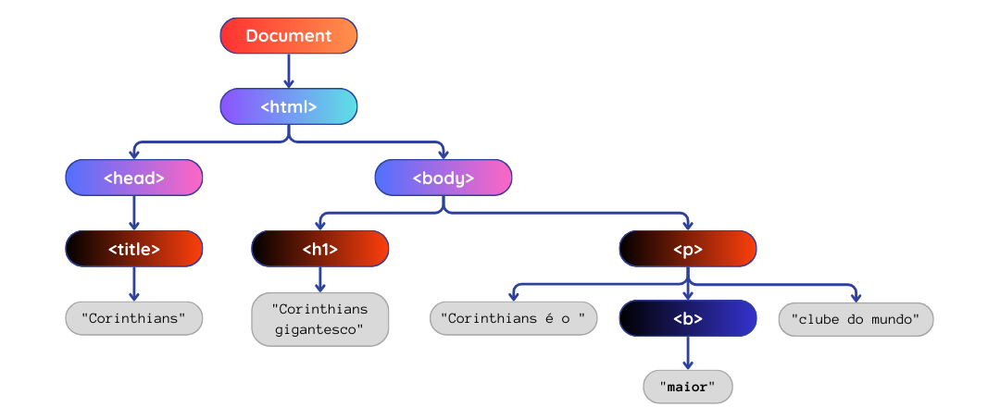
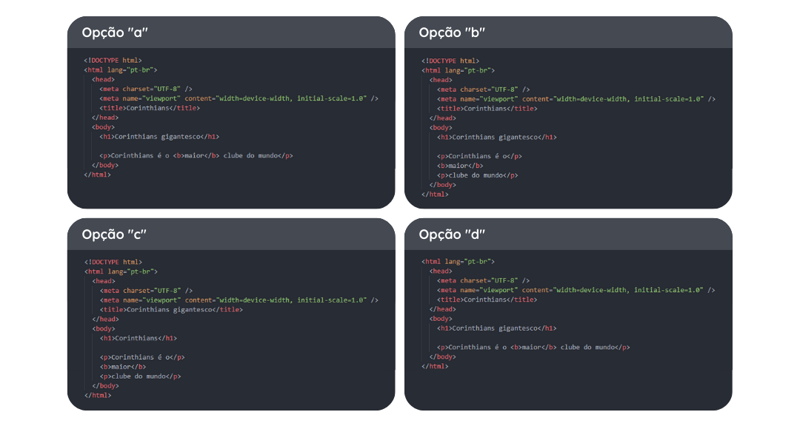

## O que é?

**DOM** é uma sigla em inglês que significa _Document Object Model_ (Modelo de Documento do Objeto). Basicamente é um conjunto de objetos dentro do seu navegador que vai dar acesso aos componentes internos do seu site. Durante o processo de renderização e loading da página WEB, o navegador transforma cada elemento em um objeto JS. Esses objetos são armazenados em uma estrutura de árvore, essa árvore é o DOM. Ou seja, é um tipo de modelagem da estrutura do HTML de algum site.

### Árvore DOM

Para entendermos melhor essa árvore, primeiro vamos entender como sua estrutura funciona. Ela é bem semelhante à uma árvore genealógica, em que temos os pais que se dividem em filhos, que se dividem em mais filhos e assim por diante.

Podemos utilizar nosso conhecimento aprendido lá em HTML sobre a estrutura básica de um documento para fazer uma árvore DOM. Relembrando aquela estrutura, temos:

> Lá no topo temos o “pai” de todos os elementos, o `document`
>
> > Dentro do document temos a tag `html`
> >
> > > Dentro do html temos o `head`
> > >
> > > > Dentro do **head** temos o nosso `title`
> > >
> > > Dentro do html também temos o `body`
> > >
> > > > Dentro do nosso **body** temos vários tipos de elementos que definem o nosso site

Vamos utilizar esse exemplo simples de um documento HTML, mas agora contendo, dentro de body, um título e uma lista com dois itens.

```html
<!DOCTYPE html>
<html>
  <head>
    <title>DOM é legal</title>
  </head>
  <body>
    <h1 id="título">DOM é uma coisa legal</h1>

    <ul id="lista">
      <li class="item">Item 1</li>
      <li class="item">Item 2</li>
    </ul>
  </body>
</html>
```

A partir deste exemplo vamos montar a árvore DOM da nossa página. Como todas as árvores de HTML, o topo é composto pelo `document`, depois pelo `html`, que se divide em `head` e `body`. O nosso `head` tem só um “filho”, o `title`, e o nosso `body` tem 2, o `h1` e o `ul`, dentro dessa subdivisões, temos 2 `li` dentro do `ul`. Com isso obtemos:


Já sabemos o que é essa árvore de DOM, mas para o que ela vai ser útil? Ela é o caminho para acessarmos os elementos que queremos, dentro da nossa estrutura HTML. Utilizando isso poderemos manipular os elementos.

### Funcionalidades e aplicações

O DOM nos traz diversas funcionalidades que ajudam a resolver problemas em nossos projetos, além de deixar o nosso site ainda mais dinâmico. Tais funcionalidades nos permitem manipular os elementos do nosso projeto, possibilitando, por exemplo, acessar e alterar seu conteúdo, criar, inserir ou remover elementos, modificar propriedades CSS para estilização e manipular eventos (`click`, `mouseover`, `mouseout`, `keyup`, `keydown`, etc.). À medida que os conteúdos forem apresentados, você entenderá melhor o funcionamento dessas ferramentas e verá suas aplicações práticas.

---

## Videoaula

<video src="https://www.youtube.com/embed/HML5E048auM" />

---

import Quiz from "@site/src/components/Quiz";

## Quiz

As questões abaixo fazem menção ao que você aprendeu no conteúdo escrito e no vídeo sobre introdução de DOM em JS.

<Quiz
  question="1. O que é DOM?"
  answers={[
    "Uma técnica avançada de design de páginas da web.",
    "Uma linguagem de programação para criação de páginas da web.",
    "Um método de manipulação do array.",
    "É um modelo da estrutura do HTML de algum site, composto por elementos convertidos em objetos JS.",
    "Um acesso à uma página WEB que foi convertido em uma árvore plantada em prol do combate ao aquecimento global.",
  ]}
  correctIndex={3}
/>

<Quiz
  question="2. Como é formada a árvore DOM?"
  answers={[
    "A árvore DOM é formada por alguns elementos HTML em uma única entidade.",
    "É um processo automático realizado pelo JS durante o processo de subir a página para a WEB pela primeira vez.",
    "Os elementos HTML são transformados em objetos JavaScript e organizados em uma estrutura de árvore.",
    "O desenvolvedor precisa desenhar manualmente a árvore DOM usando uma ferramenta de modelagem.",
    "A árvore DOM é construída a partir da interpretação do CSS pelo navegador.",
  ]}
  correctIndex={2}
/>

Árvore DOM para o quiz 3:




<Quiz
  question="3. Qual é o código que representa corretamente a árvore DOM acima?"
  answers={["a)", "b)", "c)", "d)"]}
  correctIndex={0}
/>
