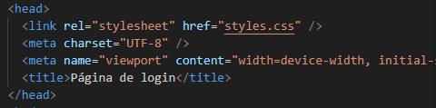

### O que é?

Assim como o HTML, o CSS (Cascating Style Sheet) não é realmente uma linguagem de programação, mas também não é uma linguagem de marcação — é uma linguagem de folhas de estilos. Isso significa que o CSS permite aplicar estilos seletivamente a elementos em documentos HTML.
A definição mais simples e precisa encontra-se na homepage das CSS no site do W3C e diz:

“Folha de estilo em cascata é um mecanismo simples para adicionar estilos (por exemplo: fontes, cores, espaçamentos) aos documentos web”

### Para que serve?

Como dito anteriormente, CSS é uma linguagem para especificar como os documentos são apresentados aos usuários, uma vez que o HTML foi criado para ser uma linguagem exclusivamente de marcação e estruturação de conteúdos.
O CSS pode ser usado para estilizar um documento muito básico de texto — por exemplo, alterando a cor e tamanho dos títulos e links

### Como adicionar ao documento?

1. Crie um arquivo na mesma pasta em que se encontra o seu documento HTML e salve-o como `styles.css`. A extensão .css nos informa que se trata de um arquivo CSS.
2. Para ligar o `styles.css` ao `index.html` adicione a seguinte linha em algum lugar dentro do `<head>` do documento HTML:

```
<link rel="stylesheet" href="styles.css" />
```

#### Exemplo:



3. Salve a página (Ctrl + S)
4. Teste se funcionou adicionando o seguinte código na página `styles.css` (não se esqueça de salvar toda vez que houver alguma alteração)

```
h1 {
    color: red;
}
```
