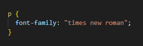
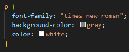
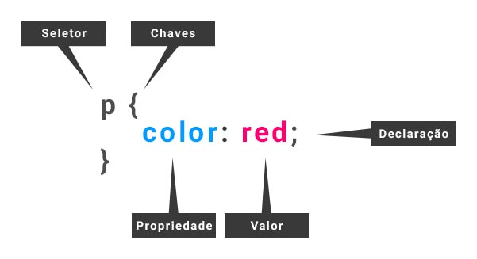
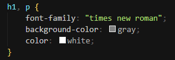

Uma regra CSS é a unidade básica de uma folha de estilo. Entenda-se como unidade básica a menor porção de código capaz de produzir um efeito de estilização. Uma regra CSS é composta por: seletor e uma declaração, sendo a declaração a junção da propriedade e do valor.

### Definições

- Seletor - Este é o nome do elemento HTML no início do conjunto de regras. Ele define os elementos a serem estilizados (neste exemplo, `
` elementos). Para estilizar um elemento diferente, basta alterar o seletor.
- Declaração - Determina os parâmetros de estilização. Compreende a propriedade e o valor
- Propriedade - Define qual será a característica do elemento, alvo do seletor, a ser estilizado. São maneiras pelas quais você pode estilizar um elemento HTML

- Valor - É a quantificação ou qualificação da propriedade

### Observações:

1. Cada conjunto de regras deve ser colocado entre { }
2. Dentro de cada declaração, você deve usar dois pontos ( : ) para separar a propriedade de seu valor ou valores.
3. Dentro de cada conjunto de regras, você deve usar ponto e vírgula ( ; ) para separar cada declaração da próxima.
4. Quando o valor de uma propriedade for uma palavra composta, separada por espaços, deve-se usar sinais de aspas duplas (“ “) ou de aspas simples (‘ ‘). Por exemplo:

### Modificando múltiplos valores de propriedade de uma vez

Para modificar vários valores de propriedade em um conjunto de regras, escreva-os separados por ponto e vírgula, assim:

### Selecionando múltiplos elementos

Também é possível selecionar vários tipos de elementos e aplicar um único conjunto de regras a todos eles. Inclua múltiplos seletores separados por vírgulas. Por exemplo:

