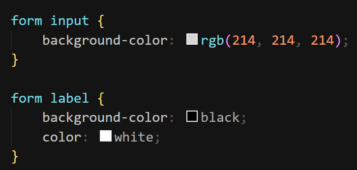
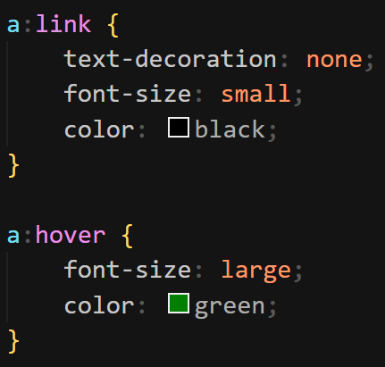

### Estilizando coisas baseadas em sua localização no documento

Há momentos quando você desejará que algo se pareça diferente, baseado onde ele está no documento. Por exemplo, ao colocar um background-color no `<form>`,
os seus filhos ( `<label>` e `<input>` ) teriam o mesmo background-color. Pode-se fazer com que cada um de seus filhos tenha um background-color diferente
utilizando um seletor chamado combinador descendente, o qual consiste em separar dois seletores por um espaço, por exemplo:

### Estilizando coisas baseadas no estado

É amplamente utilizado para estilizar links. Quando aplicado um estilo a um link, é necessário especificar o elemento `<a>` (âncora). Isto possui diferentes estados, dependendo se ele foi visitado, se não foi visitado, se o mouse está passando por ele, se foi teclado ou no processo de ser clicado (ativado). Exemplo:

Nesse exemplo, foi utilizado o _text-decoration_ para retirar o underline do “Cadastre-se” e o _a:hover_ serve para fazer alguma alteração ao passar com o mouse no link.
