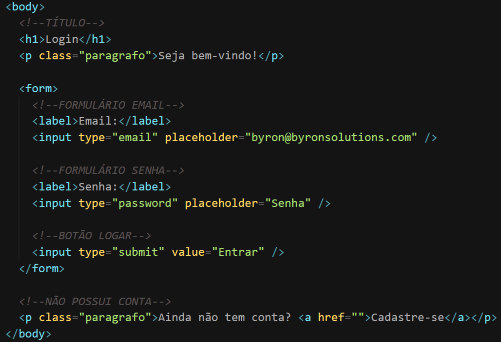
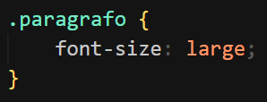
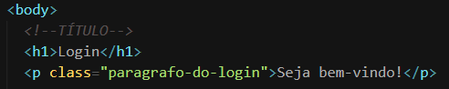
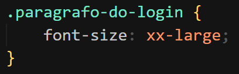
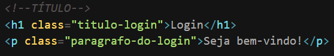
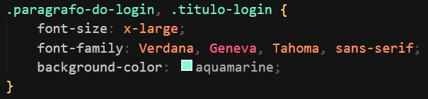

### Classe

O seletor de classe começa com um caractere de ponto (.). Ele selecionará tudo no documento HTML com essa classe aplicada a ele. A classe deve ser colocada dentro da tag e tem o formato class=”nome”. Veja o exemplo:

Arquivo HTML

  
&nbsp;
Arquivo CSS
&nbsp;

---

A classe pode conter mais de uma palavra e deverá seguir o seguinte modelo:

  
&nbsp;
Arquivo HTML
&nbsp;

  
&nbsp;
Arquivo CSS
&nbsp;

---

Também é possível aplicar o mesmo conjunto de regras a duas ou mais classes. Veja:

  
&nbsp;
Arquivo HTML
&nbsp;

  
&nbsp;
Arquivo CSS
&nbsp;
