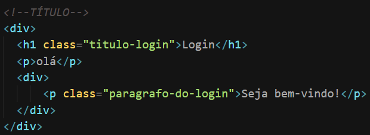
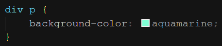
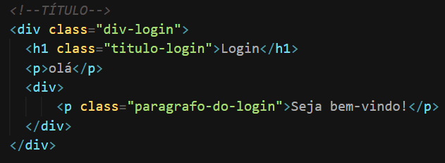
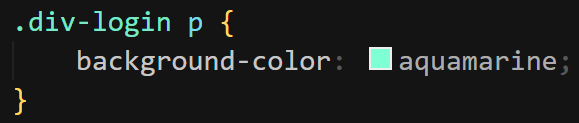

Este seletor é formado por um ou mais elementos (seletores) separados por um espaço em branco. No caso do exemplo abaixo, perceba que todos os filhos `
` da div serão estilizados com o _background-color_

  
&nbsp;
Arquivo HTML
&nbsp;

  
&nbsp;
Arquivo CSS
&nbsp;

---

O modelo mostrado acima é funcional, mas para um código com muitas divs não seria. Por esse motivo, é importante adicionar classes às divs. Exemplo:

  
&nbsp;
Arquivo HTML
&nbsp;

  
&nbsp;
Arquivo CSS
&nbsp;
