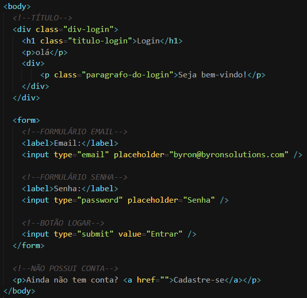
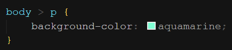
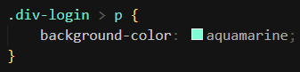

É colocado um ( > ) entre dois seletores. Esse seletor é responsável por aplicar a estilização apenas aos filhos diretos do primeiro seletor. Por exemplo:

  
&nbsp;
Note que o `
` na penúltima linha é filho direto de `<body>`, mas o “olá” e o “Seja bem-vindo!” não são
&nbsp;

  
&nbsp;
Selecionando apenas o filho direto de `<body>`
&nbsp;

---

Também é possível usar esse seletor com uma classe. Veja:

  
&nbsp;
Estilizando o “olá”, que é filho direto da div login
&nbsp;
