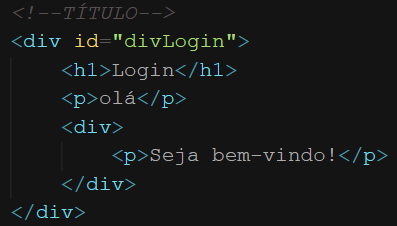
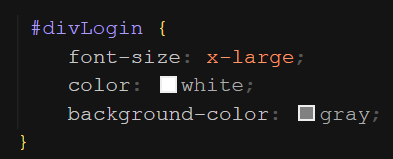

O seletor de classe começa com uma hashtag (#). A principal característica do seletor de id é que ele serve para identificar uma parte única do código, diferente do seletor de classe, que tem usos mais gerais e pode ser usado o mesmo nome várias vezes num mesmo documento de HTML. A sintaxe é muito semelhante ao id de classe, deve ser colocado o atributo id dentro de uma tag e atribuir valor a esse id. Por exemplo:

> #### IMPORTANTE
>
> Um id com mais de uma palavra deve seguir a nomenclatura camelcase (a primeira letra a partir da segunda palavra deve ser maiuscula), já o seletor de classe segue a nomenclatura do kebab case (as palavras são separadas por hífen)
