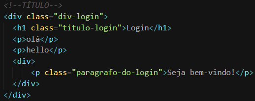
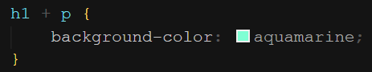

É colocado um (+) entre dois seletores. Esse seletor é responsável por aplicar a estilização apenas ao irmão adjacente, ou seja, o irmão mais próximo a ele. Por exemplo:

  
&nbsp;
Observe que o “olá” e o “hello” são irmãos de `<h1>`, porém apenas o “olá” é irmão-adjacentemas o “olá” e o “Seja bem-vindo!” não são
&nbsp;

  
&nbsp;
Estilizando o “olá”
&nbsp;
