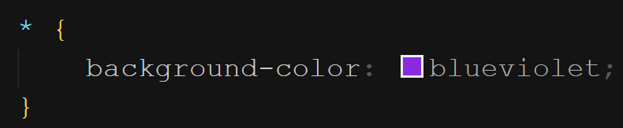

É o seletor que casa com todos os elementos contidos no documento. Todas as instâncias de todos os elementos são alvos do seletor. Este seletor é representado pelo sinal gráfico asterisco (\*). Exemplo:

