Uma área do documento organizada usando flexbox se chama flex container.

1. Cole o código no arquivo HTML

```
<body>
    <section class="container">
        <article class="box">
            card 1
        </article>
        <article class="box">
            card 2
        </article>
        <article class="box">
            card 3
        </article>

    </section>
</body>
```

---

2. Cole no arquivo CSS

```
.container {
    background-color: gray;
    height: 300px;
}

.box {
    background-color: green;
    padding: 20px;
    margin: 5px;
    width: 200px;
  }
```

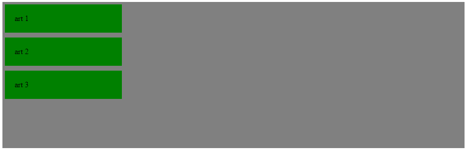  
&nbsp;
Como deve ficar
&nbsp;

---

3. Adicione display flex na classe container e note que a disposição dos elementos mudou. Isso ocorre porque a propriedade display flex já tem outras propriedades embutidas (o flex-direction row é uma delas). Caso queira alterar a disposição padrão, será necessário adicionar valor à propriedade flex-direction

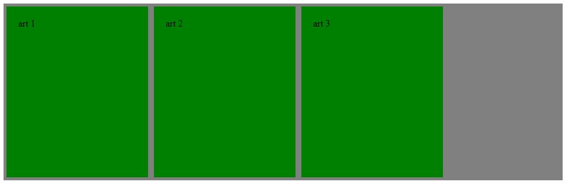  
&nbsp;
Como deve ficar
&nbsp;

---

4. Adicionando o flex-direction: column:

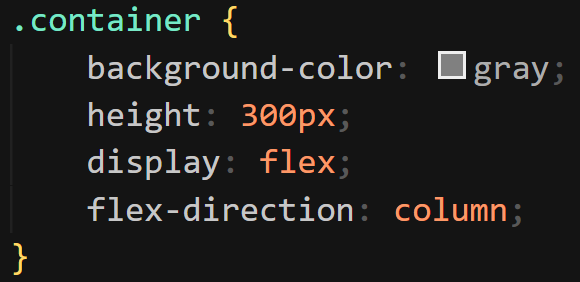  
&nbsp;

&nbsp;

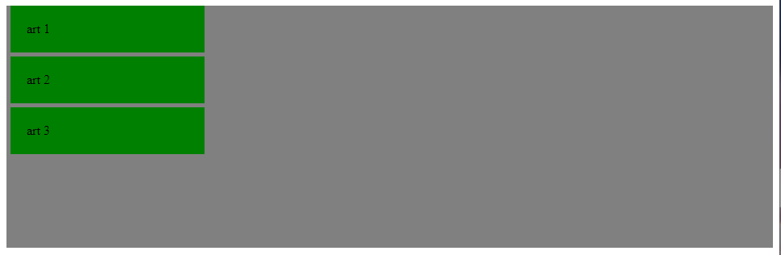  
&nbsp;
Como deve ficar
&nbsp;

##### Teste os outros dois valores para a propriedade flex-direction (row-reverse, column-reverse)

---

5. Flex-wrap: define se haverá uma quebra de linha ou não. Entenda como funciona:

Adicione as linhas:

```
.container {
    flex-wrap: nowrap;
}
```

```
.box {
    width: 50%;
}
```

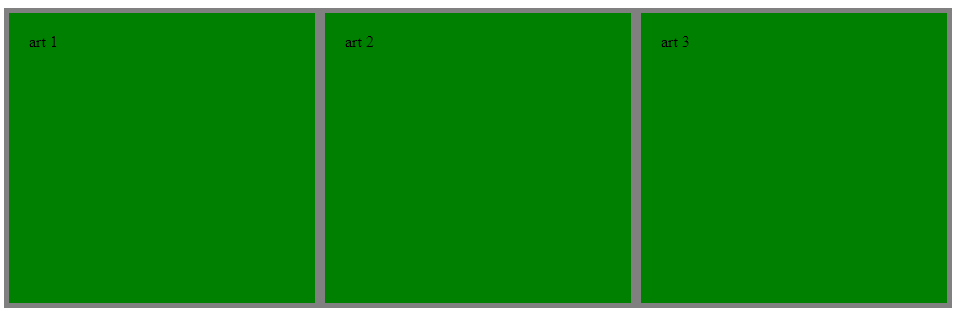  
&nbsp;
Note que não houve quebra, uma vez que eles não ocuparam 50%
&nbsp;

Agora volte na propriedade flex-wrap e mude seu valor para wrap:
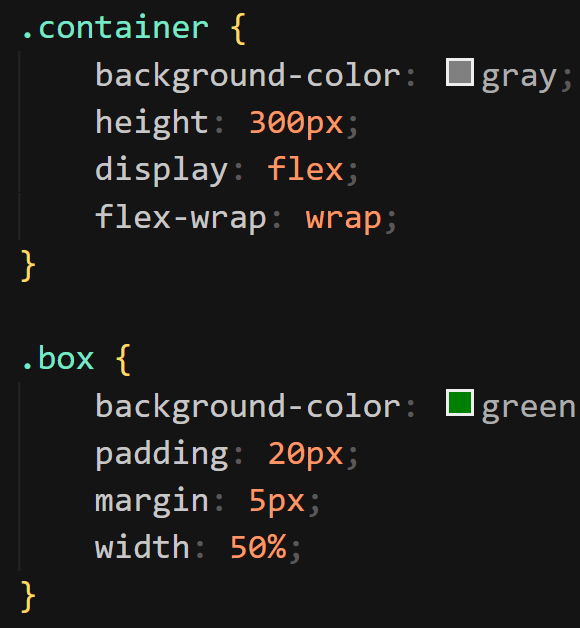  
&nbsp;

&nbsp;

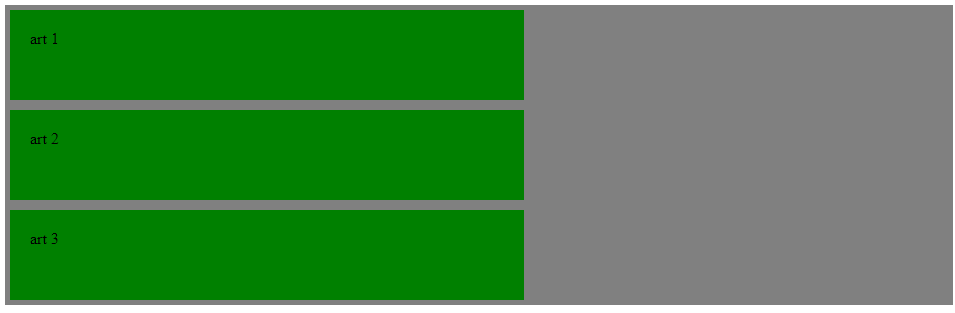  
&nbsp;
Note que houve quebra e cada um ocupa 50%
&nbsp;

---

6. Justify-content: serve para fazer um alinhamento horizontal. Seu valor padrão é flex-start (alinhar da esquerda para a direita).

- Mude o width para 30px
- Altere height para 500px
- Volte o flex-wrap para nowrap
- Experimente colocar justify-content: center na classe container

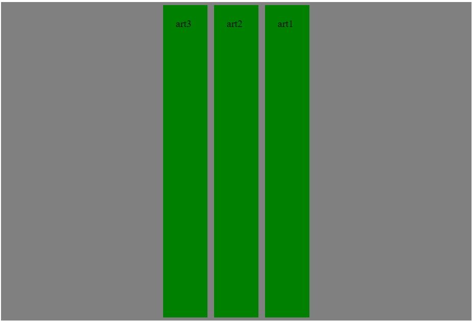  
&nbsp;
Perceba que os elementos se alinham no centro
&nbsp;

Altere o justify-content para space-between
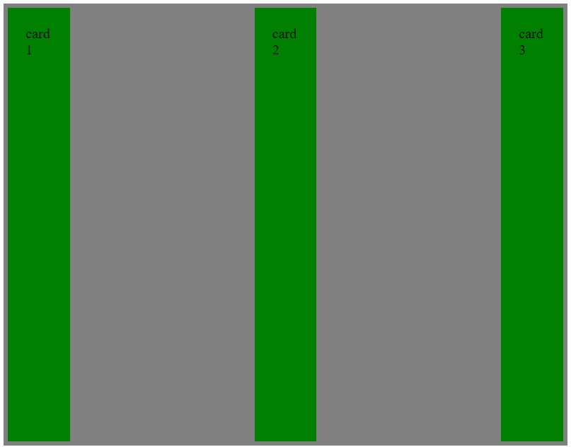  
&nbsp;
Note que os elementos mantêm o mesmo espaçamento entre si
&nbsp;

Altere o justify-content para space-around
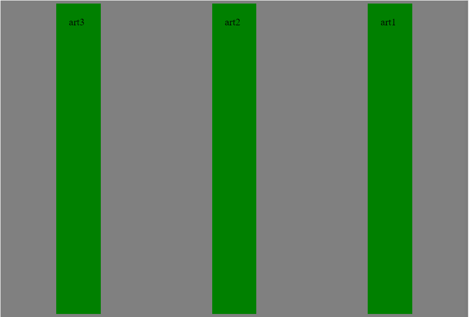  
&nbsp;

&nbsp;

---

7. Align-items: faz um alinhamento vertical

Adicione align-items: start
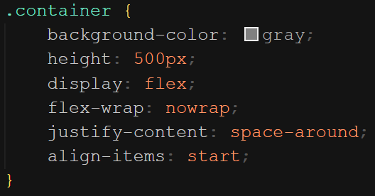  
&nbsp;

&nbsp

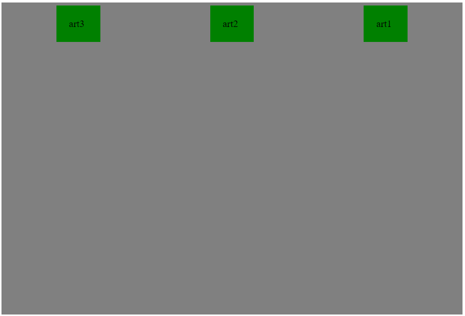  
&nbsp;
Note que os elementos estão no topo da página
&nbsp

Mude o align-items para center
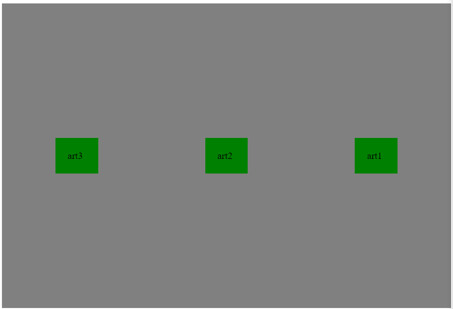  
&nbsp;
Veja que os elementos estão no centro da página
&nbsp

Mude o align-items para end
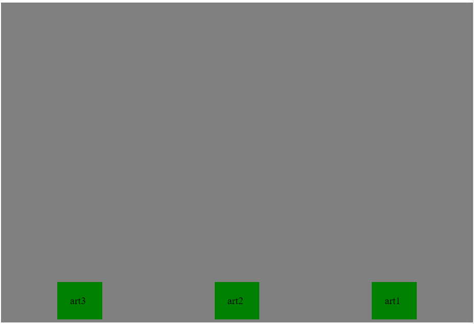  
&nbsp;
Veja que os elementos estão no final da página
&nbsp

---

8. Align-content: irá fazer um alinhamento vertical quando houver uma quebra

- Altere o width para 200px
- Adicione um height na classe box de 50px
- Altere o flex-wrap para wrap
- Mude o justify-content para start
- Altere o align-content para start

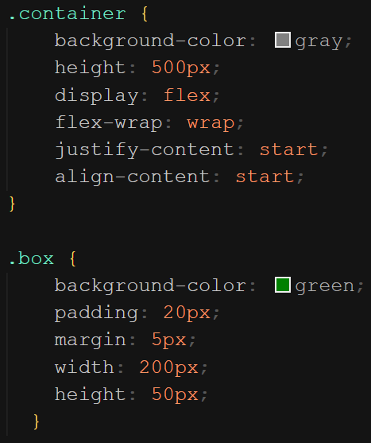  
&nbsp;

&nbsp

  
&nbsp;
Ficará dessa forma
&nbsp
