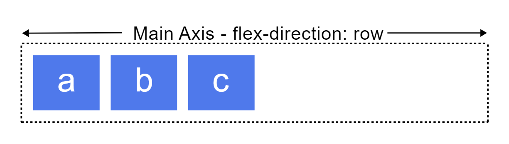
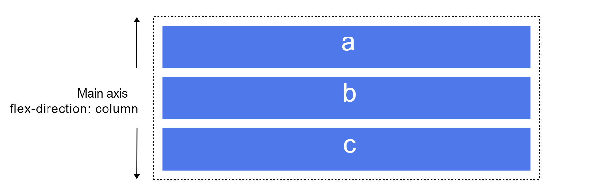
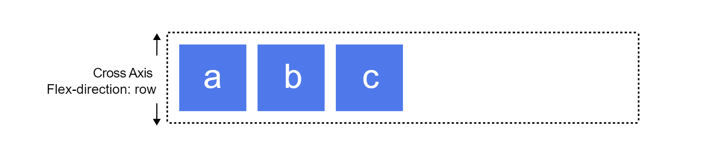
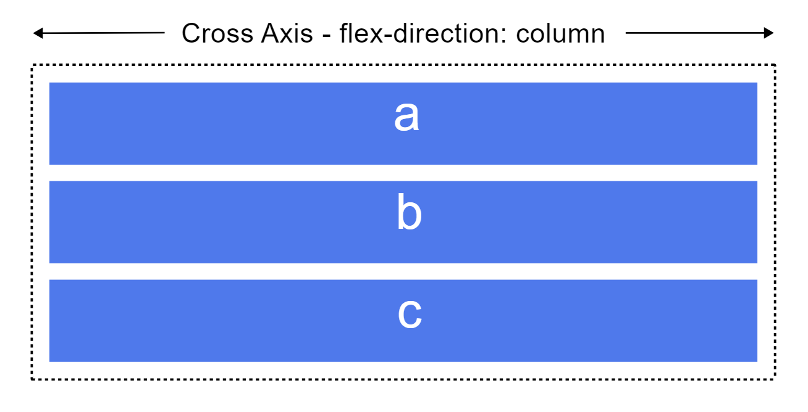
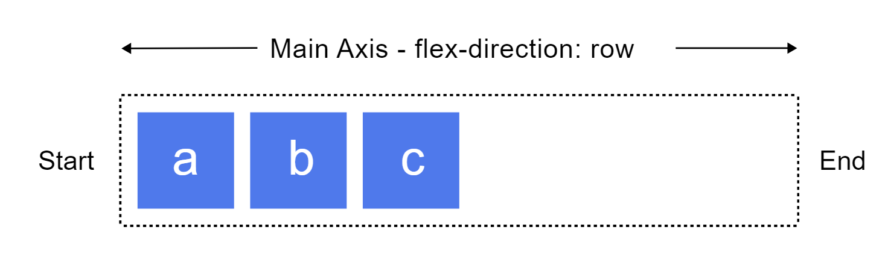

Ao trabalhar com flexbox é necessário pensar em termos de dois eixos, o principal e o transversal. O eixo principal é definido pela propriedade flex-direction e o eixo transversal é perpendicular a ele. Tudo que é feito no flexbox remete a esses eixos.

**Eixo principal**

A propriedade flex-direction pode assumir quatro valores:

- Row
- Row-reverse
- Column
- Column-reverse

Se você escolher row ou row-reverse, seu eixo principal percorrerá a linha na direção inline.

Escolha column ou column-reverse e o eixo principal irá do topo até a parte inferior da página - na direção do bloco.

**Eixo transversal**

O eixo transversal corre perpendicularmente ao eixo principal, portanto, se o flex-direction (eixo principal) estiver definido como row ou row-reverse o eixo transversal desce pelas colunas.

Se o eixo principal for column ou column-reverse então o eixo transversal corre ao longo das linhas.

**Importante**

Se for flex-direction e row e você estiver trabalhando em inglês, a borda inicial do eixo principal estará à esquerda e a borda final à direita.

