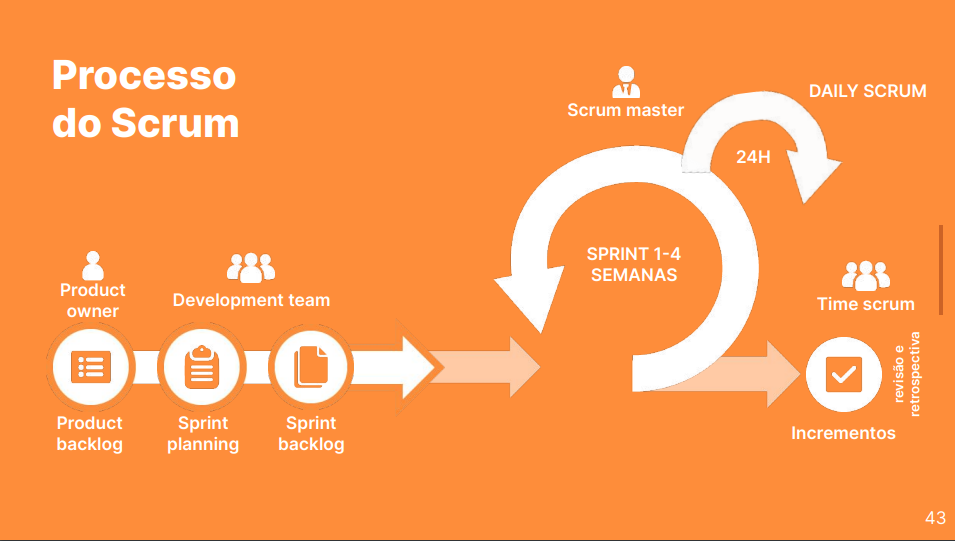

# Metodologias Ágeis

## Sumário

  - [1. Introdução a Agilidade e Métodos Ágeis](#1-introdução-a-agilidade-e-métodos-ágeis)
    - [1.1 Definição de Agilidade](#11-definição-de-agilidade)
    - [1.2 Os valores do Manifesto Ágil](#12-os-valores-do-manifesto-ágil)
  - [2. Práticas Ágeis](#2-práticas-ágeis)
    - [2.1 SCRUM](#21-scrum)
    - [2.1.1 Os pilares e valores do SCRUM](#211-os-pilares-e-valores-do-scrum)
      - [Três Pilares do Scrum:](#três-pilares-do-scrum)
      - [Cinco Valores do Scrum:](#cinco-valores-do-scrum)
    - [2.1.2 Artefatos, Papéis e Eventos no SCRUM](#212-artefatos-papéis-e-eventos-no-scrum)
      - [Artefatos do Scrum:](#artefatos-do-scrum)
      - [Papéis do Scrum:](#papéis-do-scrum)
      - [Eventos do Scrum:](#eventos-do-scrum)
    - [2.1.2 O Fluxo do Processo de Trabalho do SCRUM](#212-o-fluxo-do-processo-de-trabalho-do-scrum)
    - [2.1.3 SCRUM GUIDE](#213-scrum-guide)
    - [2.2 Extreme Programming (XP)](#22-extreme-programming-xp)
    - [2.2.1 O que é Extreme Programming](#221-o-que-é-extreme-programming)
    - [2.2.2 História e Origem](#222-história-e-origem)
    - [2.2.3 Valores do Extreme Programming](#223-valores-do-extreme-programming)
      - [Comunicação](#comunicação)
      - [Simplicidade](#simplicidade)
      - [Feedback](#feedback)
      - [Coragem](#coragem)
  - 
    - [2.2.4 Práticas do Extreme Programming](#224-práticas-do-extreme-programming)
      - [Desenvolvimento Orientado por Testes (TDD)](#desenvolvimento-orientado-por-testes-tdd)
      - [Programação em Par](#programação-em-par)
      - [Integração Contínua](#integração-contínua)
      - [Refatoração](#refatoração)
      - [Propriedade Coletiva do Código](#propriedade-coletiva-do-código)
    - [2.2.5 Fases do Extreme Programming](#225-fases-do-extreme-programming)
      - [Fase de Exploração](#fase-de-exploração)
      - [Fase de Planejamento](#fase-de-planejamento)
      - [Fase de Iteração até o Lançamento**](#fase-de-iteração-até-o-lançamento)
      - [Fase de Produção](#fase-de-produção)
      - [Fase de Manutenção](#fase-de-manutenção)
    - [2.2.6 Artefatos do Extreme Programming](#226-artefatos-do-extreme-programming)
      - [Testes de Aceitação**](#testes-de-aceitação)
      - [Código](#código)
      - [Plano de Iteração](#plano-de-iteração)
      - [Planos de Release e Iteração](#planos-de-release-e-iteração)
      - [Histórias](#histórias)
      - [Cartões de História](#cartões-de-história)
      - [Testes Unitários](#testes-unitários)
      - [Código Funcionando em Cada Iteração](#código-funcionando-em-cada-iteração)
    - [2.2.7 Benefícios do Extreme Programming](#227-benefícios-do-extreme-programming)
      - [Melhoria da Qualidade do Software](#melhoria-da-qualidade-do-software)
      - [Resposta Rápida a Mudanças](#resposta-rápida-a-mudanças)
      - [Satisfação do Cliente](#satisfação-do-cliente)
    - [2.2.8 Desafios e Considerações](#228-desafios-e-considerações)
      - [Adaptação Cultural](#adaptação-cultural)
      - [Escala](#escala)
      - [Disciplina](#disciplina)
      - [Conclusão](#conclusão)
      - [O Futuro do XP](#o-futuro-do-xp)

**Abstract:** “Faaaaala meu querido byroniano, nessa etapa traremos diversos conceitos envolvendo agilidade que será indispensável na sua jornada na byron para trabalhar em equipe em projetos de desenvolvimento de software e também para sua vida, então aproveite o máximo esse conteúdo :D”

## 1. Introdução a Agilidade e Métodos Ágeis

### 1.1 Definição de Agilidade

Quando exploramos o conceito de agilidade no desenvolvimento de software, não estamos apenas enfatizando a rapidez. Agilidade abrange muito mais do que simplesmente acelerar o processo. É uma abordagem que valoriza a adaptabilidade e a eficiência. Para ilustrar, imagine planejar uma viagem: ser ágil não é apenas dirigir em alta velocidade até o destino. É sobre selecionar o caminho mais eficaz, estar preparado para desvios inesperados e desfrutar da jornada, ajustando-se conforme necessário para atingir o destino da melhor maneira possível.

Essa jornada em direção à agilidade é frequentemente comparada à busca por uma "bala de prata", uma solução única e definitiva que resolveria todos os problemas de uma vez. No entanto, como afirmou Frederick P. Brooks Jr. em seu famoso ensaio "No Silver Bullet", essa solução mágica não existe. A agilidade é um processo contínuo de aprendizado e adaptação, que requer abordagens flexíveis e uma mentalidade de melhoria constante. Assim, enquanto buscamos alcançar a agilidade no desenvolvimento de software, devemos estar cientes de que não há soluções simples ou universais, mas sim um compromisso com a evolução e a inovação contínuas.

Concomitantemente, o **Manifesto Ágil** foi criado em uma reunião histórica que ocorreu em fevereiro de 2001, nas montanhas nevadas de Utah, nos Estados Unidos. Um grupo de 17 profissionais, que já praticavam métodos ágeis como XP (Extreme Programming), DSDM (Dynamic Systems Development Method), Scrum, FDD (Feature-Driven Development) **(alguns desses serão tratados em próximos capítulos, não se preocupe)**, entre outros, se reuniram para discutir uma nova abordagem para o desenvolvimento de software.

Esses profissionais estavam insatisfeitos com os métodos tradicionais de desenvolvimento, que eram considerados pesados e burocráticos, e buscavam alternativas mais flexíveis e eficientes. Durante a reunião, eles compartilharam experiências e identificaram os pontos em comum que levaram ao sucesso de seus projetos. Com base nessa discussão, eles formularam o **Manifesto para Desenvolvimento Ágil de Software**, que ficou conhecido como Manifesto Ágil.

Para conhecer mais sobre o Manifesto Ágil, você pode acessar o link:

[Manifesto para Desenvolvimento Ágil de Software](https://agilemanifesto.org/iso/ptbr/manifesto.html)

### 1.2 Os valores do Manifesto Ágil

Segue a baixo os principais valores que o Manifesto Ágil ilustra:

1. **Indivíduos e interações mais que processos e ferramentas**: Valoriza-se mais as pessoas e suas interações do que seguir processos e utilizar ferramentas específicas.
2. **Software em funcionamento mais que documentação abrangente**: Prioriza-se o software funcional e em execução como principal medida de progresso, em vez de uma documentação extensa e detalhada.
3. **Colaboração do cliente mais que negociação de contratos**: Enfatiza-se a colaboração contínua com o cliente ao longo do processo de desenvolvimento, em vez de se basear apenas em negociações contratuais.
4. **Responder a mudanças mais que seguir um plano**: Valoriza-se a capacidade de adaptação e flexibilidade para responder a mudanças, em vez de aderir rigidamente a um plano inicial.

## 2. Práticas Ágeis

### 2.1 SCRUM

O **Scrum** é uma **framework ágil** amplamente utilizada em projetos, que tem como objetivo promover a colaboração, a flexibilidade e a entrega de valor contínua. Ele é essencial na gestão de projetos, pois permite a adaptação rápida às mudanças do projeto e às necessidades das pessoas stakeholders.

Uma das melhores formas de nos aprofundarmos nesse tema é lendo bastante a respeito dele. Por isso, indicamos algumas leituras sobre Scrum para que você possa complementar os seus estudos com a gente. Confira!

- [Livro **Scrum: Gestão ágil para produtos de sucesso**](https://www.casadocodigo.com.br/products/livro-scrum), do autor Rafael Sabbagh.
- [Livro **Scrum 360: Um guia completo e prático de agilidade**](https://www.casadocodigo.com.br/products/livro-scrum-360), do autor Jorge Audy. Nesses dois livros, você encontrará boas práticas e técnicas complementares ao Scrum Guide, trazidas a partir da experiência de mercado de ambos os autores.
- [Livro **Scrum: A arte de fazer o dobro do trabalho na metade do tempo**](https://www.google.com/search?q=Scrum:+A+arte+de+fazer+o+dobro+do+trabalho+na+metade+do+tempo&rlz=1C1CHZN_pt-BRBR970BR970&sxsrf=APwXEdeZcx-lRZOcLv6JgtjgbjLrdK7tsQ:1681846218578&source=lnms&sa=X&ved=0ahUKEwiIzrKzlbT-AhWZrJUCHbMdBqIQ_AUIwAcoAA&biw=1536&bih=746&dpr=1.25), dos autores Jeff e J.J. Sutherland. Essa leitura é importante, pois foi o primeiro livro sobre o tema, sendo essencial para aqueles que desejam compreender e aplicar a metodologia Scrum de forma eficaz, possibilitando o aumento da produtividade e a entrega de resultados significativos em projetos.

Em cada um desses livros você perceberá o Scrum de forma mais aprofundada, conhecendo também algumas dicas de como aplicá-lo em seus projetos a partir da experiência validada dos autores.

### 2.1.1 Os pilares e valores do SCRUM

O Scrum é fundamentado em três pilares e segue cinco valores principais. Aqui estão eles:

#### **Três Pilares do Scrum:**

1. **Transparência**: Todos os aspectos relevantes do processo devem ser visíveis para as partes envolvidas. Isso inclui o progresso do trabalho, os desafios enfrentados, as decisões tomadas e as mudanças que ocorrem ao longo do tempo. A transparência promove a confiança e a colaboração entre os membros da equipe e os stakeholders.
2. **Inspeção**: Durante o processo de desenvolvimento, é essencial que o time e os stakeholders inspecionem regularmente os artefatos produzidos e o progresso do trabalho. Isso permite identificar problemas e oportunidades de melhoria precocemente, possibilitando ajustes necessários para garantir a qualidade e a entrega bem-sucedida do produto.
3. **Adaptação**: Com base nas informações obtidas por meio da inspeção, é importante que o time de desenvolvimento e os stakeholders possam adaptar o processo, os planos e o produto de acordo com as mudanças nas circunstâncias ou nos requisitos. A capacidade de adaptação é essencial para garantir que o produto final atenda às necessidades do cliente de forma eficaz.

#### **Cinco Valores do Scrum:**

1. **Comprometimento**: Os membros da equipe devem estar comprometidos com o sucesso do projeto e dispostos a contribuir com seus melhores esforços para alcançar os objetivos estabelecidos.
2. **Coragem**: É necessário coragem para enfrentar desafios, admitir erros, buscar feedback e fazer mudanças quando necessário. A coragem é essencial para promover a melhoria contínua e a inovação.
3. **Foco**: O time deve manter o foco nos objetivos do projeto e nas entregas prioritárias, evitando distrações e garantindo que o trabalho realizado agregue valor ao cliente.
4. **Respeito**: Respeitar os membros da equipe, os stakeholders e as opiniões divergentes é fundamental para promover um ambiente de trabalho colaborativo e produtivo.
5. **Abertura**: A abertura à comunicação franca e transparente é crucial para garantir uma troca eficaz de informações, ideias e feedback entre todos os envolvidos no projeto.

Esses pilares e valores são fundamentais para o sucesso da implementação do Scrum e para promover uma cultura de colaboração, adaptação e excelência na entrega de produtos e projetos.

### 2.1.2 Artefatos, Papéis e Eventos no SCRUM

No Scrum, artefatos são elementos tangíveis como o Product Backlog, papéis definem as responsabilidades como o Product Owner, Scrum Master e Time de Desenvolvimento, enquanto eventos são reuniões regulares como Sprint Planning, Daily Scrum, Sprint Review e Sprint Retrospective. Esses componentes estruturam o processo ágil, promovendo transparência, colaboração e adaptação contínua para entregar valor ao cliente de forma iterativa e incremental.

#### **Artefatos do Scrum:**

1. **Product Backlog**: Uma lista priorizada de todos os requisitos, funcionalidades, melhorias e correções de bugs que precisam ser feitas no produto. O Product Backlog é de propriedade do Product Owner e é usado pelo time de desenvolvimento para planejar e priorizar o trabalho durante as Sprints.
2. **Sprint Backlog**: Uma lista de todas as tarefas que o time de desenvolvimento planeja realizar durante uma Sprint para alcançar o objetivo da Sprint. O Sprint Backlog é criado durante o Sprint Planning e é atualizado conforme o progresso é feito ao longo da Sprint.
3. **Incremento de Produto**: O resultado tangível do trabalho realizado pelo time de desenvolvimento durante uma Sprint. Um incremento de produto é uma versão potencialmente entregável do produto que contém todas as funcionalidades completas e testadas que foram selecionadas para aquela Sprint.

#### **Papéis do Scrum:**

1. **Product Owner**: Responsável por representar os interesses dos stakeholders e garantir que o produto desenvolvido atenda às necessidades do cliente e agregue valor ao negócio. O Product Owner é responsável por gerenciar o Product Backlog, definir as prioridades dos itens do backlog e garantir que o time de desenvolvimento tenha uma compreensão clara dos requisitos do produto.
2. **Scrum Master**: Responsável por garantir que o time de desenvolvimento compreenda e siga os princípios e práticas do Scrum. O Scrum Master atua como um facilitador, removendo impedimentos que possam atrapalhar o progresso do time, promovendo um ambiente de colaboração e aprendizado contínuo, e ajudando o time a alcançar sua máxima eficácia.
3. **Time de Desenvolvimento**: Composto por profissionais multifuncionais que são responsáveis por transformar os itens do Product Backlog em incrementos de produto potencialmente entregáveis. O time de desenvolvimento é auto-organizado e colaborativo, trabalhando juntos para atingir os objetivos da Sprint e entregar valor ao cliente.

#### **Eventos do Scrum:**

1. **Sprint Planning**: Uma reunião que acontece no início de cada Sprint, onde o Product Owner e o time de desenvolvimento colaboram para definir o objetivo da Sprint e selecionar as tarefas do Product Backlog que serão realizadas durante aquela Sprint.
2. **Daily Scrum**: Uma reunião diária de curta duração, geralmente de 15 minutos, onde o time de desenvolvimento se reúne para sincronizar atividades e discutir o progresso do trabalho. Cada membro do time responde a três perguntas básicas: o que fez desde a última reunião, o que planeja fazer até a próxima reunião e se há algum impedimento que esteja atrapalhando o progresso.
3. **Sprint Review**: Uma reunião que acontece no final de cada Sprint, onde o time de desenvolvimento demonstra o incremento de produto concluído para o Product Owner e outros stakeholders. Durante a Sprint Review, são discutidos os resultados alcançados, feedback recebido e possíveis ajustes no Product Backlog.
4. **Sprint Retrospective**: Uma reunião que acontece no final de cada Sprint, onde o time de desenvolvimento revisa o processo de trabalho durante a Sprint e identifica oportunidades de melhoria. O objetivo da Sprint Retrospective é promover a aprendizagem contínua e a adaptação do processo para maximizar a eficácia da equipe.

### 2.1.2 O Fluxo do Processo de Trabalho do SCRUM

O Fluxo do Processo de Trabalho do SCRUM é dividido em diversas etapas de forma iterativa ou seja, que envolve a repetição de ciclos de trabalho curtos e sucessivos, chamados de iterações ou Sprints.

O Scrum, uma metodologia ágil amplamente utilizada, oferece um fluxo de trabalho iterativo que permite o desenvolvimento e a entrega de soluções de maneira flexível e adaptativa. Aqui está uma visão detalhada de como o Scrum funciona:

1. **Product Owner e Product Backlog:**
   - O Product Owner, representando o cliente ou usuário final, define as prioridades e requisitos do projeto, compilando-os no Product Backlog, uma lista detalhada de funcionalidades e necessidades essenciais.
2. **Sprint Planning:**
   - A equipe de desenvolvimento se reúne no Sprint Planning para analisar o Product Backlog e planejar as atividades da próxima Sprint.
3. **Sprints e Sprint Backlog:**
   - As Sprints são ciclos curtos de trabalho, geralmente entre uma e quatro semanas, nos quais a equipe seleciona itens do Product Backlog e os transfere para o Sprint Backlog, onde são detalhados os objetivos e atividades específicas da Sprint.
4. **Desenvolvimento e Daily Scrums:**
   - Durante a Sprint, a equipe se dedica ao desenvolvimento da solução, realizando Daily Scrums para monitorar o progresso, identificar obstáculos e ajustar o plano conforme necessário.
5. **Entrega Incremental:**
   - Ao final de cada Sprint, a equipe entrega um incremento do produto ou serviço, pronto para ser utilizado ou testado pelos usuários finais e stakeholders, permitindo feedback rápido e contínuo.
6. **Sprint Review:**
   - No evento de Sprint Review, o incremento entregue é revisado e discutido, proporcionando uma oportunidade para avaliar os resultados alcançados e identificar possíveis melhorias.
7. **Sprint Retrospective:**
   - Após a Sprint Review, a equipe realiza a Sprint Retrospective, uma reflexão sobre o processo de trabalho, destacando o que funcionou bem, o que pode ser melhorado e definindo ações para aprimoramento contínuo.
8. **Ciclo de Trabalho Recorrente:**
   - Com base nas lições aprendidas, o ciclo de trabalho se reinicia, com a equipe ajustando o planejamento e incorporando melhorias para a próxima Sprint.

O Scrum possibilita o desenvolvimento contínuo e a avaliação iterativa da solução, garantindo que o produto final atenda às necessidades do cliente de maneira eficaz. É fundamental para o sucesso da equipe que todos compreendam e apliquem os princípios e práticas do Scrum de forma consistente.

Aqui está uma imagem para exemplificar todo o fluxo do processo de trabalho do SCRUM:

### 2.1.3 SCRUM GUIDE

O **SCRUM Guide** é um manual que define o Scrum, uma estrutura de gestão ágil de projetos que ajuda equipes a estruturar e gerenciar o trabalho de forma eficiente. [Ele serve como um guia para implementar o Scrum, detalhando os valores, princípios e práticas que compõem essa metodologia](https://www.atlassian.com/br/agile/scrum).

O Scrum é amplamente utilizado por equipes de desenvolvimento de software, mas seus princípios também podem ser aplicados a outros tipos de projetos de equipe. [O guia descreve as funções dentro de uma equipe Scrum, como o **Product Owner**, o **Scrum Master** e os **Developers**, além de eventos como **Sprints**, **Sprint Planning**, **Daily Scrum**, **Sprint Review** e **Sprint Retrospective**](https://scrumguides.org/docs/scrumguide/v2020/2020-Scrum-Guide-PortugueseBR-3.0.pdf).

O objetivo do Scrum é promover um ambiente onde as equipes possam aprender com as experiências, se organizar para resolver problemas e refletir sobre sucessos e fracassos para melhorar continuamente. [O Scrum Guide contém a definição do Scrum e explica cada elemento do framework, que é essencial para o valor geral e os resultados obtidos com o Scrum](https://scrumguides.org/docs/scrumguide/v2020/2020-Scrum-Guide-PortugueseBR-3.0.pdf).

### 2.2 Extreme Programming (XP)

### 2.2.1 O que é Extreme Programming

Extreme Programming (XP) é uma metodologia de desenvolvimento ágil de software que visa melhorar a qualidade do software e a capacidade de resposta às mudanças dos requisitos do cliente. XP promove uma série de práticas específicas destinadas a aumentar a produtividade e a eficiência das equipes de desenvolvimento de software.

### 2.2.2 História e Origem

Extreme Programming foi criado por Kent Beck no início dos anos 1990. Beck introduziu XP enquanto trabalhava no projeto C3 (Chrysler Comprehensive Compensation System). O objetivo era encontrar uma abordagem que permitisse desenvolver software de forma mais eficiente e com maior qualidade. Beck, juntamente com outros pioneiros como Ward Cunningham e Ron Jeffries, desenvolveu os princípios e práticas fundamentais do XP.

### 2.2.3 Valores do Extreme Programming

#### Comunicação

A comunicação clara e constante entre a equipe e o cliente é essencial. XP promove reuniões frequentes, feedback contínuo e colaboração próxima para garantir que todos estejam alinhados e informados.

#### Simplicidade

Focar no que é necessário para atender às necessidades atuais do projeto. A simplicidade nas soluções permite ajustes rápidos e manutenção facilitada.

#### Feedback

O feedback contínuo é uma prática fundamental para melhorar o processo de desenvolvimento. Isso inclui feedback do cliente, testes de software e revisões regulares do código.

#### Coragem

A coragem é necessária para enfrentar desafios, tomar decisões difíceis e adaptar-se rapidamente a mudanças nos requisitos ou no ambiente de desenvolvimento.

##

### 2.2.4 Práticas do Extreme Programming

#### Desenvolvimento Orientado por Testes (TDD)

Desenvolvimento Orientado por Testes, ou TDD (Test-Driven Development), é uma prática onde os testes são escritos antes do código de produção. A ideia é primeiro criar um teste que falhe, depois escrever o código mínimo necessário para passar no teste e, finalmente, refatorar o código para melhorar sua estrutura sem alterar sua funcionalidade. Isso garante que cada parte do código seja testada desde o início, promovendo a qualidade e a confiabilidade do software.

#### Programação em Par

Dois programadores trabalham juntos no mesmo código. Esta prática melhora a qualidade do código, facilita a troca de conhecimento e reduz a ocorrência de erros. Enquanto um programador escreve o código, o outro revisa cada linha à medida que é escrita, permitindo uma colaboração constante e detecção imediata de problemas.

#### Integração Contínua

Integração Contínua é a prática de integrar e testar o código frequentemente, várias vezes ao dia se possível. Sempre que um desenvolvedor adiciona ou modifica uma parte do código, essas mudanças são integradas ao código existente e testadas automaticamente. Isso permite detectar problemas cedo, evitando grandes falhas e garantindo um produto mais estável.

#### Refatoração

Refatoração é o processo de melhorar continuamente o design do código sem alterar seu comportamento externo. Isso envolve reestruturar o código para torná-lo mais limpo, eficiente e fácil de entender, enquanto garante que ele ainda passe em todos os testes. A refatoração é uma prática contínua que ajuda a manter o código em um estado saudável e adaptável.

#### Propriedade Coletiva do Código

Qualquer membro da equipe pode melhorar qualquer parte do código. Isso promove a responsabilidade compartilhada e garante que o conhecimento do sistema seja distribuído entre todos os membros da equipe, facilitando a manutenção e a evolução do software.

### 2.2.5 Fases do Extreme Programming

#### **Fase de Exploração**

**Objetivo:** Esta fase tem como objetivo principal entender as necessidades do cliente e explorar as possibilidades do projeto.

**Atividades:**

- **Reuniões com o Cliente:** O time de desenvolvimento se reúne com o cliente para compreender suas necessidades e expectativas.
- **Coleta de Histórias de Usuário:** São coletadas histórias de usuário, que são descrições de funcionalidades desejadas pelo cliente, escritas de maneira simples e clara.
- **Protótipos e Experimentos:** O time pode desenvolver protótipos ou realizar experimentos para explorar possíveis soluções técnicas e avaliar sua viabilidade.
- **Treinamento e Preparação:** Caso necessário, o time pode passar por treinamentos para adquirir conhecimentos específicos que serão úteis no projeto.

#### **Fase de Planejamento**

**Objetivo:** Estabelecer um plano de ação para o desenvolvimento do projeto com base nas histórias de usuário coletadas.

**Atividades:**

- **Priorização das Histórias de Usuário:** O cliente ajuda a priorizar as histórias de usuário com base no valor de negócio.
- **Estimação de Tempo e Recursos:** O time de desenvolvimento estima o esforço necessário para implementar cada história de usuário.
- **Planejamento das Iterações:** As histórias de usuário são distribuídas em várias iterações, cada uma com uma duração curta (geralmente de 1 a 3 semanas).
- **Definição do Backlog:** Criação do backlog do projeto, uma lista ordenada de todas as histórias de usuário a serem desenvolvidas.

#### **Fase de Iteração até o Lançamento**

**Objetivo:** Implementar as funcionalidades priorizadas de maneira incremental e iterativa, até que o sistema esteja pronto para ser lançado.

**Atividades:**

- **Desenvolvimento Iterativo:** Em cada iteração, o time desenvolve, testa e entrega um conjunto de histórias de usuário completas.
- **Revisão e Ajustes:** Ao final de cada iteração, o time revisa o progresso, coleta feedback do cliente e faz ajustes necessários.
- **Integração Contínua:** O código é constantemente integrado ao repositório principal, garantindo que mudanças sejam testadas e integradas frequentemente.

#### **Fase de Produção**

**Objetivo:** Preparar o sistema para ser lançado em produção, garantindo que ele esteja estável e pronto para uso pelos usuários finais.

**Atividades:**

- **Testes Finais:** Realização de testes finais para garantir que o sistema atende aos requisitos e está livre de defeitos críticos.
- **Documentação:** Produção de documentação necessária para a operação e manutenção do sistema.
- **Treinamento dos Usuários:** Treinamento dos usuários finais e do time de operações, se necessário.
- **Lançamento:** Implementação do sistema no ambiente de produção.

#### **Fase de Manutenção**

**Objetivo:** Garantir que o sistema continue a atender às necessidades dos usuários após o lançamento, realizando ajustes e melhorias contínuas.

**Atividades:**

- **Suporte e Correção de Bugs:** Resolução de problemas e defeitos que surgirem durante o uso do sistema.
- **Implementação de Novas Funcionalidades:** Desenvolvimento e integração de novas funcionalidades conforme surgem novas necessidades ou requisitos dos clientes.
- **Refatoração:** Melhoria contínua do código existente para manter a qualidade e a manutenibilidade do sistema.
- **Monitoramento e Otimização:** Monitoramento do desempenho do sistema e realização de otimizações conforme necessário.

Amostra do quadro de Visualização do Extreme Programming:

### 2.2.6 Artefatos do Extreme Programming

No Extreme Programming (XP), artefatos são itens tangíveis ou intangíveis que ajudam a equipe a gerenciar, entender e melhorar o processo de desenvolvimento de software. Eles fornecem estrutura, documentação e feedback durante todo o ciclo de desenvolvimento. Aqui está uma explicação detalhada de cada um dos artefatos no XP:

#### **Testes de Aceitação**

Os testes de aceitação são escritos para verificar se as funcionalidades do sistema atendem aos requisitos especificados pelos clientes. Eles são geralmente criados com base em histórias de usuário (user stories) e são executados para garantir que o sistema cumpra as expectativas dos clientes antes de ser considerado completo. Esses testes são frequentemente automatizados e servem como uma forma de validação do comportamento do sistema.

#### **Código**

O código é o principal produto do processo de desenvolvimento. No XP, o código é constantemente revisado e melhorado através de práticas como programação em par e refatoração. O foco é manter o código simples, limpo e funcional, facilitando a manutenção e a escalabilidade.

#### **Plano de Iteração**

O plano de iteração detalha as tarefas e objetivos específicos para um ciclo de desenvolvimento, geralmente com duração de uma a duas semanas. Ele define quais histórias de usuário serão implementadas durante a iteração e é ajustado com base no feedback contínuo e no progresso real.

#### **Planos de Release e Iteração**

O plano de release é uma visão de longo prazo que mapeia quando o produto ou suas funcionalidades principais serão entregues aos clientes. O plano de iteração, como mencionado anteriormente, é um plano de curto prazo para uma iteração específica. Juntos, esses planos ajudam a equipe a gerenciar expectativas e a manter o desenvolvimento alinhado com os objetivos do negócio.

#### **Histórias**

As histórias de usuário são descrições breves de funcionalidades ou requisitos do sistema do ponto de vista do usuário final. Elas servem como unidades de trabalho para a equipe de desenvolvimento e são escritas em linguagem simples para facilitar a comunicação entre desenvolvedores e clientes.

#### **Cartões de História**

Os cartões de história são representações físicas ou digitais das histórias de usuário. Eles contêm uma descrição da funcionalidade, critérios de aceitação e, possivelmente, notas adicionais. Esses cartões são usados durante o planejamento de iterações e como lembretes visuais durante o desenvolvimento.

#### **Testes Unitários**

Os Testes Unitários verificam a funcionalidade de pequenas partes isoladas do código, geralmente funções ou métodos individuais. Eles são escritos pelos desenvolvedores antes ou durante a codificação e são executados automaticamente para garantir que cada unidade do código funcione corretamente. No XP, a prática de Test-Driven Development (TDD) é comum, onde os testes são escritos antes do código funcional.

#### **Código Funcionando em Cada Iteração**

Uma das principais metas do XP é ter código funcionando ao final de cada iteração. Isso significa que a equipe entrega incrementos de software que são totalmente testados e funcionais. Esse enfoque garante que há sempre uma versão utilizável do software disponível, permitindo lançamentos frequentes e feedback constante dos clientes.

### 2.2.7 Benefícios do Extreme Programming

#### Melhoria da Qualidade do Software

XP contribui para a entrega de software de alta qualidade através de práticas como TDD, programação em par e integração contínua, que garantem que o código seja constantemente testado e aprimorado.

#### Resposta Rápida a Mudanças

A capacidade do XP de adaptar-se rapidamente a novos requisitos permite que as equipes respondam de maneira eficiente às mudanças nas necessidades do cliente. As práticas ágeis e iterativas do XP facilitam a incorporação de feedback e ajustes frequentes.

#### Satisfação do Cliente

O foco do XP em atender às necessidades do cliente, através de feedback constante e iterações curtas, resulta em maior satisfação do cliente. O cliente está envolvido em todo o processo de desenvolvimento, garantindo que o produto final atenda às suas expectativas e necessidades.

### 2.2.8 Desafios e Considerações

#### Adaptação Cultural

Incorporar os valores do XP em diferentes ambientes de trabalho pode ser desafiador. É importante promover uma cultura de comunicação aberta e colaboração, onde todos se sintam confortáveis para compartilhar ideias e feedback.

#### Escala

A aplicabilidade do XP em projetos de diferentes tamanhos pode variar. Práticas como programação em par e TDD podem ser ajustadas para atender às necessidades de projetos maiores ou menores, mas a implementação pode exigir ajustes específicos para funcionar eficazmente em grandes equipes ou projetos.

#### Disciplina

Seguir as práticas do XP requer uma disciplina rigorosa. A equipe deve estar comprometida em manter as práticas e valores para alcançar os benefícios do XP. Isso inclui aderir a ciclos de feedback curtos, práticas de teste contínuas e melhorias constantes no código.

#### Conclusão

#### O Futuro do XP

O XP continua a evoluir e se adaptar às novas tendências de desenvolvimento de software. A adoção de práticas XP pode ajudar as equipes a permanecerem ágeis e eficientes, mesmo em um ambiente de rápido crescimento tecnológico. Com a contínua evolução das ferramentas e técnicas de desenvolvimento, o XP pode se tornar ainda mais relevante e eficaz no futuro.

Veja mais conteúdos sobre Extreme Programming feitos pela byron:

[https://youtu.be/xjgDX_FBwjg](https://youtu.be/xjgDX_FBwjg)

Referências:

- Scrum Guide: Schwaber, K., & Sutherland, J. (2020). The Scrum Guide™. Disponível em: [Scrum.org](https://scrumguides.org/docs/scrumguide/v2020/2020-Scrum-Guide-US.pdf#zoom=100).
- Scrum: Scrum.org. (2020). O que é Scrum?. Disponível em: Scrum.org. Atlassian. (2020). Scrum: Um guia ágil. Disponível em: [Atlassian.com](https://www.atlassian.com/br/agile/scrum#:~:text=O%20que%20%C3%A9%20o%20scrum,de%20valores%2C%20princ%C3%ADpios%20e%20pr%C3%A1ticas.).
- Extreme Programming (XP): BECK, Kent. Extreme Programming. Disponível em: [http://www.extremeprogramming.org/](http://www.extremeprogramming.org/).
- Extreme Programming (XP): Wikipedia contributors. (2020). Extreme Programming. Wikipedia, The Free Encyclopedia. Disponível em: Wikipedia. Agile Alliance. (2020). Extreme Programming (XP). Disponível em: [AgileAlliance.org](https://www.agilealliance.org/glossary/xp/).
- Extreme Programming at a glance: [https://jdmeier.com/extreme-programming-at-a-glance/](https://jdmeier.com/extreme-programming-at-a-glance/)