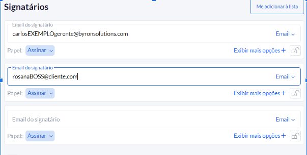
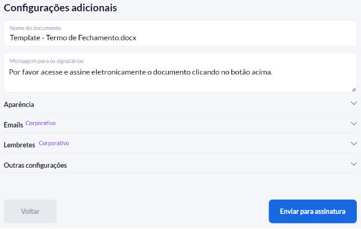
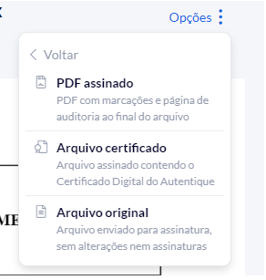

#  
Autentique

**Diretoria:** DPR

**Desenvolvido por:** Felipe do Quental Anunciação  
**Data:** 31/08/2023

**Verificado por:**  
**Data:** 

---

O Autentique é um site de autenticação digital, ele possui uma plataforma que usamos para as diversas assinaturas que precisamos nos documentos que fazemos. O site é projetado para verificar a identidade dos usuários, permitindo que apenas pessoas autorizadas acessem determinados recursos, serviços ou informações online. A autenticação digital é crucial para a validade jurídica dos documentos que emitimos.

## 
 LINKS ÚTEIS
[Autentique.](https://www.autentique.com.br/)

## 
 FLUXOGRAMA

<iframe style="border:none" width="800" height="450" src="https://whimsical.com/embed/ENisE6VMhSpdCZ9Dho1f5i"></iframe>

## 
 ETAPAS DO PROCESSO

### I. Login na plataforma

Como: Para se usar a plataforma do Autentique, é preciso logar nele com as credenciais de DPR para facilitar aos membros da Byron  acesso aos documentos emitidos na plataforma. Para logar, basta acessar a página inicial do site e clicar em “Entrar”, nesta nova página preencha os campos de email e senha com os dados encontrados no board de “Credenciais” no Mattermost de DPR.

### II. Novo Documento

Como: Logado no site, você terá acesso ao painel da plataforma onde se encontra os documentos já emitidos anteriormente, para fazer um novo documento clique em “Novo documento” e nesta nova página, adicione o documento (ele suporta tanto doc ou PDF). Na lateral esquerda adicione os emails dos signatários (pessoas que devem assinar o documento) e clique em avançar.

Informe que dados da pessoa serão usados para validar a assinatura da mesma (Exemplo: CPF), ao selecionar o documento ganhará destaque e você deverá clicar diretamente no documento a posição que quer a assinatura no documento. Clicando novamente em “Avançar” você irá para a última etapa da criação, onde você deve configurar algumas informações para o envio do documento.

### III. Envio do documento

Como: Na última etapa de criação do documento, você pode configurar o envio, podendo editar um texto padrão para o email aos signatários, o nome do documento, adicionar lembrete e outras configurações de aparência. Finalizando a configuração, basta clicar em “Enviar para a assinatura” e o documento será enviado para os signatários assinarem. Vale ressaltar que após esse processo de envio, na plataforma do Autentique você pode ver se os emails foram enviados; abertos; documento visualizado ou assinado, com essas informações você pode ver o andamento das assinaturas. 

### IV. Gerar um PDF com as assinaturas

Como: Com todas as assinaturas feitas no documento, basta clicar em “Opções” , selecionar “Baixar arquivo” e clicar em “PDF assinado”, assim será baixado o documento com as assinaturas e em formato PDF, agora basta colocar o documento na pasta correta do DRIVE e informar as pessoas responsáveis em saber que o documento já foi assinado por todos os signatários.

