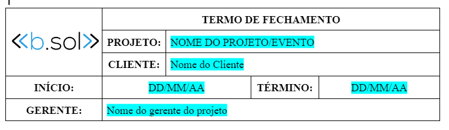

#  
 Termo de fechamento

**Diretoria:** DPR

**Desenvolvido por:** Felipe do Quental Anunciação  
**Data:** 25/08/2023

**Verificado por:**  
**Data:** 

---

 
Descrição: O Termo de Fechamento é o último documento feito para finalizar o projeto, nele é informado que os serviços do contrato foram prestados para o Cliente e o mesmo está de acordo com o serviço. Esse documento é feito por DPR após o fim do projeto e também do recebimento de todo o pagamento.

## 
 LINKS ÚTEIS
- [Autentique.](https://www.autentique.com.br/)
- [Drive de projetos.](https://drive.google.com/drive/folders/1blgYPjLC1FPqoElna-Wb9sbmXRqX5-rc?usp=drive_link)
- [Template Termo de Fechamento.](https://docs.google.com/document/d/1_ppUVi13IffdrNLoET9si333moAiL01Z/edit?usp=drive_link&ouid=105143080137186213699&rtpof=true&sd=true)
- [Controle de Recebimento.](https://drive.google.com/drive/folders/1g6UKf8gOomUZO5kddBf2iv0ET7tunkPk?usp=drive_link)
- [MatterMost.](https://mattermost.byronsolutions.com/)

## 
 FLUXOGRAMA

## 
 ETAPAS DO PROCESSO

### I. Coletando as informações

Como: Procure as informações referente ao projeto através do contrato ou PTEC, na pasta do projeto em: Geral - b.sol>Projetos>”ano”>”mês” . Caso falte alguma informação ou fique em dúvida, entre em contato com a pessoa de vendas que ficou responsável como PO do projeto, ela saberá lhe passar os dados que não encontrou.

### II. Preencha o cabeçalho

Como: Com o template de fechamento preencha os campos do cabeçalho. 

### III. Detalhes sobre o projeto

Como: Descreva no item 1 do template as informações sobre o projeto/evento, e também insira informações sobre a entrega. Geralmente você vai encontrar essas informações nas Cláusulas iniciais de DO OBJETIVO DO CONTRATO no contrato.

### IV. Preencher as atividades incompletas

Como: Caso as atividades estejam completas, basta escrever: “Sem atividades pendentes” no item 2 do termo. Caso contrário você deverá descrever no item 2 sobre as atividades pendentes ou incompletas. Você deve pegar as informações das atividades pendentes com o gerente do projeto ou PO do mesmo.

### V. Campo de assinaturas

Como: Ao preencher o item 2, basta colocar o nome do gerente do projeto e da Contratante no final do termo de fechamento para que os mesmos possam assinar se estiverem de acordo com o que foi preenchido no termo.

### VI. Gerando um documento para assinatura online

Como: Usando a plataforma do Autentique, faça um documento para receber assinaturas digitais e envie para os signatários.

### IV. Atualizando o Drive

Como: Assim que o Termo de Fechamento estiver assinado pelo gerente e pelo cliente, upe o mesmo na pasta do projeto e depois acesse o controle de recebimento e atualize a coluna “Termo de Fechamento” para Feito. Não esqueça de avisar o PO que foi assinado o termo e o projeto foi então finalizado.

## 
 PERGUNTAS FREQUENTES

#### 1) Onde consigo o Login de DPR para o Autentique? 
> Você encontra no board de Credenciais de DPR no MatterMost

## 
 EXEMPLO

