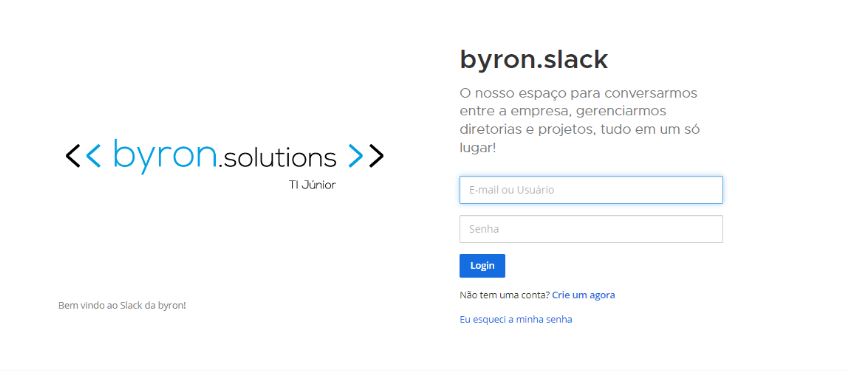
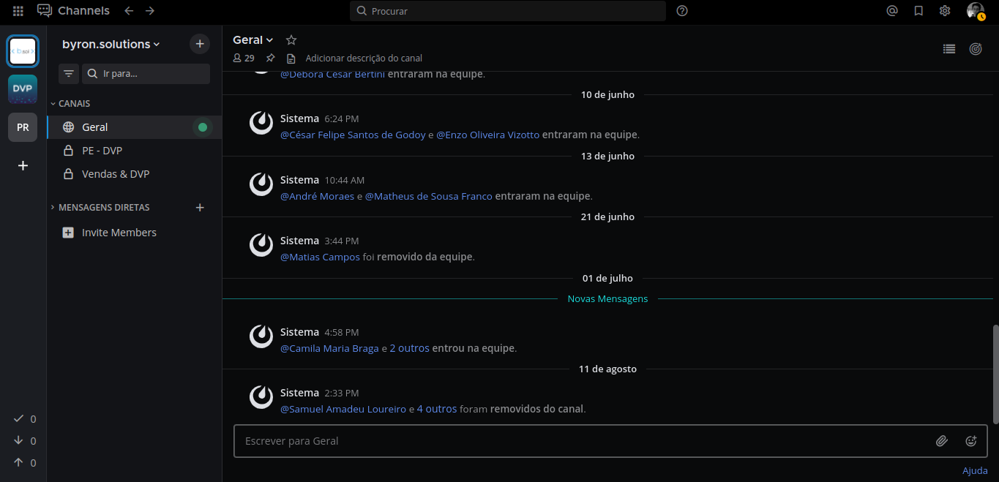

# Planejamento Estratégico

:::caution atenção

Esse mapeamento está com o desenvolvimento em progresso.

:::

## Definindo as metas do Portal

No início do ano, todos os membros devem se reunir para estabelecer as metas da byron para o trimestre.

De acordo com o Portal Brasil Júnior, os objetivos da empresa devem ser definidos de acordo com as seguintes metas:

- Valor de faturamento
- Número de membros que executam
- Número de projetos
- Ações compartilhadas
- Participação em eventos
- NPS
- Projetos de impacto

Claro, além das metas do Portal, podem ser definidas metas internas. Por exemplo, a meta de faturamento pode ser estabelecida no portal como R$59.000,00 (cinquenta e nove mil reais) e internamente como R$60.000,00 (sessenta mil reais).

## Definindo os objetivos críticos

Nesta segunda etapa, todos os membros devem se reunir para discutir o que pode ser feito para alcançar cada uma das metas.

Pode-se, por exemplo, definir que a byron precisa aumentar seu faturamento mensal para levar mais membros a eventos, ou então criar um novo projeto sem fins lucrativos para conseguir impactar a comunidade.

:::tip dica

Não se delonguem muito para definir os objetivos críticos, que devem ser bem gerais. O detalhamento deles será feito na etapa seguinte.

:::

## Desdobrando os objetivos

De acordo com os objetivos críticos definidos anteriormente, cada diretoria deve reunir seus membros para estabelecer quais ações devem realizar a fim de alcançá-los.

Por exemplo, se um dos objetivos críticos foi definido como "Consolidar nosso modelo de negócio”, uma medida possível para tal é incentivar a cultura da documentação na empresa.

:::caution atenção

Nesta etapa, é imprescindível que se atribua responsáveis e prazos para cada ação discutida.

:::

Além disso, toda ação deve ser documentada, mesmo que não seja prioritária no momento. Em etapas futuras, todas elas serão analisadas e enquadradas em sua respectiva prioridade.

Abaixo, segue um exemplo dos desdobramentos:

## Criando/Atualizando modelo de quadro Kanban

Agora, o membro responsável de cada diretoria, de acordo com o que foi reunido como ações pelos seus membros, deverá organizar as informações do processo.

Primeiramente, deve-se analisar se o modelo de quadro existe na plataforma Mattermost, seguindo a metodologia scrum. Caso exista, deve-se atualizá-lo de acordo com o que foi definido em reunião (a cada 3 meses). Caso não exista, deverão ser seguidos os seguintes passos:

:::info

Pule para o passo 6 caso o modelo já exista.

:::

- Passo 1: Inicialmente deve ser acessado o [Mattermost da byron](http://mattermost.byronsolutions.com/). Após entrar nesse link, a seguinte tela aparecerá:

- Passo 2: Caso o membro responsável possua uma conta, continue para o Passo 3. Caso o membro responsável não possua uma conta no Mattermost, crie uma conta utilizando o e-mail institucional da byron (usuário@byronsolutions.com).

- Passo 3: Após serem colocados os dados de login, o membro será direcionado para a seguinte página (algumas informações podem estar diferentes, pois estas são as informações específicas de uma das contas dos membros):

- Passo 4: Caso exista um canal (channel), continue para o passo 5. Caso não exista um canal (channel) para a respectiva diretoria do membro, deverá ser criado um. Para criar um canal clique no “+” (Figura 4) e selecione a opção “Criar Novo Canal” (Figura 5). Selecione o tipo como “privado”, e o nome deve ser “PE - sigla da respectiva diretoria”.

- Passo 5: Caso já exista um board no canal siga para o passo 6. Caso não exista, deverá ser criado um novo board. Para criá-lo, o membro deve selecionar “channels” (Figura 6), em seguida selecionar “boards” (Figura 7), selecionar então o canal da respectiva diretoria e por último escolher o template do PE (Figura 8).

- Passo 6: No board (Figura 9), caso já tenham sido adicionadas as informações sobre o planejamento estratégico do respectivo ano, o membro deve atualizar o mesmo com as novas informações do atual momento. Caso não existam as informações iniciais sobre o planejamento estratégico, as mesmas devem ser adicionadas.

:::note

Scrum é uma metodologia ágil, que se baseia em passos com o objetivo de acompanhar diariamente o andamento do projeto, detectando erros mais facilmente. Para isso, existe um cronograma a ser seguido e nele existem algumas etapas que serão listadas.
Para mais informações acesse a página sobre o [Scrum](https://www.google.com.br).

:::

## Acompanhando as metas

Mensalmente ou quinzenalmente, as metas devem ser acompanhadas seguindo-se os passos apresentados na página do [Acompanhamento do Planejamento Estratégico](https://www.google.com.br).
